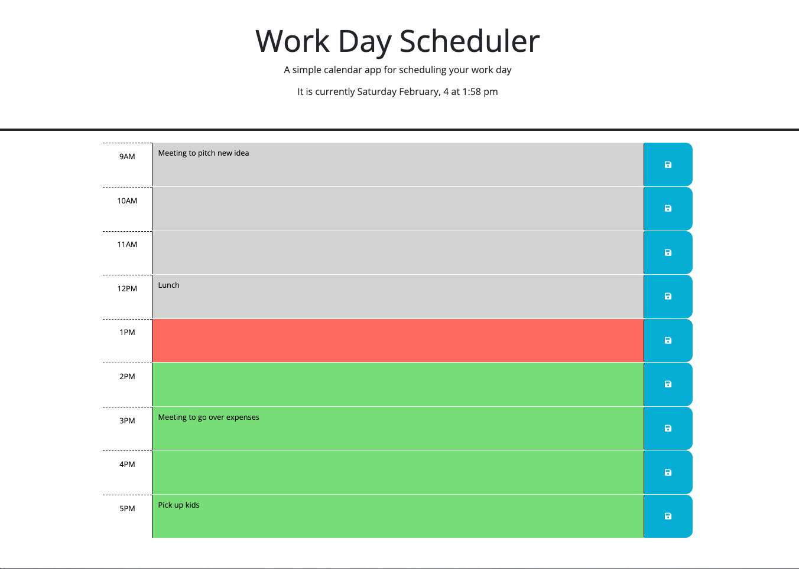

# Work Day Scheduler

## Description
For this weeks challenge, I created the javaScript to add the current date/time, add the ability to add/remove events for each hour block and have them saved by using local storage, and finally I added the ability for the scheduler to show based on color whether the event in each block is in the past, present, or future based on the current time.

This challenge I learned more about JQuery and it's functionality as well as Dayjs' uses.

## Usage

To access this work day scheduler, you can run it locally by using VScode's live server plugin. Right click on index file and select `Open with live server` 

Or

This website can be ran on Github Pages using the following link [Work Day Scheduler](https://brett-hicklin.github.io/work-day-scheduler/)

When the website has loaded, you will be greeted with the title "Work Day Scheduler" and shown the current date and time, that updates automatically. You will then see 9 time-blocks with the hours of 9AM through 5PM. The blocks will appear gray if it is before the current time (in the past), green for the present time, and red for any time-blocks later than the current hour (future). To use the scheduler, just click into the time-block desired, type in the event or reminder, and click on the blue button/tab with the floppy disk icon to the right to save the text.

example screenshot showing the layout is provided below: 

